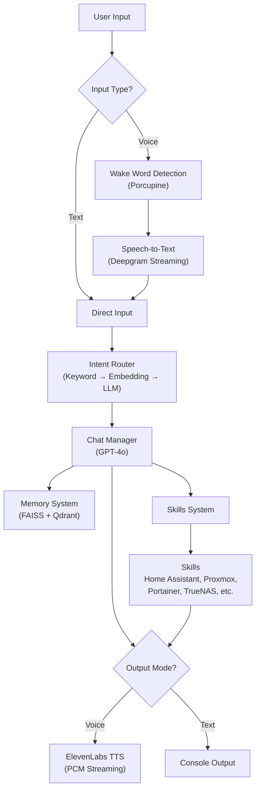
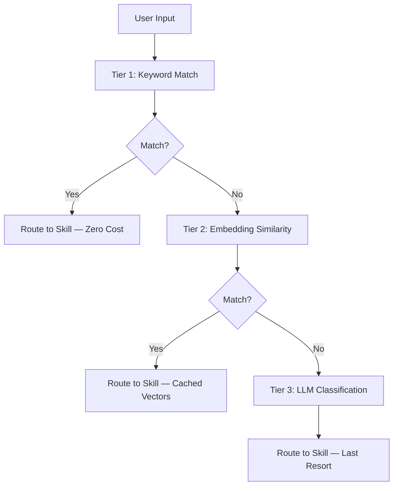
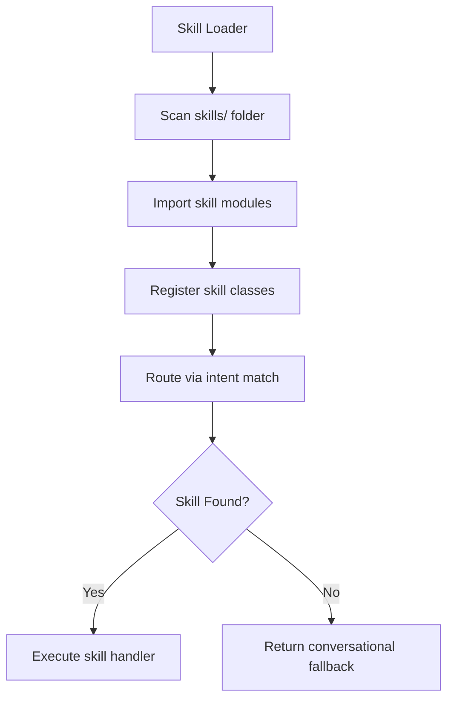
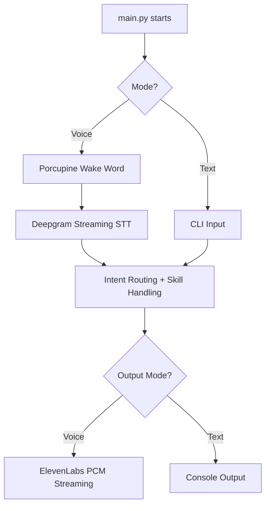

# Jarvis: A Voice-First AI Assistant for Home Automation and Banter


> **This project is under active development. Only the README is posted publicly for now — the codebase is still being cleaned up and isn't ready for release yet. Stay tuned.**

> "If I had a body, I'd roll my eyes at you right now. Fortunately for us both, I don't."
> — Jarvis

---

## Table of Contents

- [What is Jarvis?](#what-is-jarvis)
- [Architecture](#architecture)
- [Features](#features)
- [Planned Features](#planned-features)
- [Quick Start](#quick-start)
- [Configuration](#configuration)
- [Project Structure](#project-structure)
- [Voice Flow Examples](#voice-flow-examples)
- [Testing](#testing)
- [Troubleshooting](#troubleshooting)
- [Credits](#credits)
- [License](#license)

---

## What is Jarvis?

Jarvis is a voice-activated AI assistant built to control your smart home, entertain with personality, and evolve with memory. It combines OpenAI's GPT-4o with ElevenLabs TTS, Deepgram streaming STT, Home Assistant integrations, and a vector-backed memory system to simulate a snarky British AI sidekick that would make Tony Stark proud.

Jarvis currently runs locally on your machine and can:

- Control smart devices via Home Assistant
- Respond to your voice with ElevenLabs speech synthesis
- Resume Spotify playlists on demand
- Remember past interactions with short-term and long-term memory
- Understand context, wit, sarcasm, and subtlety
- Monitor infrastructure (Proxmox, Portainer, TrueNAS)
- Route intents through a 3-tier cascade (keyword, embedding, LLM)
- Fall back to local models when needed (planned)

<p align="left">
  
  <br>
  <sub><i>Live demo: Jarvis listening, thinking, and speaking in real time</i></sub>
</p>

---

## Architecture

<details>
<summary>High-Level Architecture (click to expand)</summary>



</details>

<details>
<summary>Intent Routing Flow (click to expand)</summary>



</details>

<details>
<summary>Skills System Flow (click to expand)</summary>



</details>

<details>
<summary>Voice vs. Text Mode (click to expand)</summary>



</details>

---

## Features

### Wake Word Detection

Porcupine-based wake word listener waits in standby until you say "Jarvis," then engages in conversational flow. Deactivates with phrases like "that's all for now."

### Voice Pipeline

- **Speech-to-text** via Deepgram WebSocket streaming — real-time transcription during speech
- **Text-to-speech** via ElevenLabs PCM streaming — playback begins on the first audio chunk
- **Personality** — British butler with dry wit and pre-generated acknowledgment lines

### Intent Routing

A 3-tier cascade via `SemanticIntentRouter` keeps response times low and costs down:

1. **Keyword matching** — instant, zero-cost pattern detection
2. **Embedding similarity** — cached vectors for fast semantic matching
3. **LLM classification** — last resort fallback for ambiguous inputs

### Home Assistant Integration

Pulls entity IDs automatically and converts voice commands into Home Assistant service calls. Supports native actions like `light.turn_on`, `media_player.play_media`, and Spotify casting via the `spotcast.start` service. Uses MCP as primary transport with REST fallback.

### Memory System

- **Short-term memory**: Active conversation context within each session
- **Long-term memory**: Vector-based recall powered by FAISS and Qdrant embeddings
- **Deduplication**: 0.85 similarity threshold prevents redundant storage
- **Relevance scoring**: Quality-ranked recall results
- **Memory consolidation**: Scheduled background maintenance summarizes aging entries
- **Smart tagging**: Auto-generated tags for better memory organization

### System Integrations (Skills)

| Skill | Description | Transport |
|-------|-------------|-----------|
| Home Assistant | Smart home control | MCP (REST fallback) |
| Proxmox | VM and node monitoring | MCP (REST fallback) |
| Obsidian | Notes search and retrieval | MCP |
| Portainer | Container management | REST |
| TrueNAS | Storage monitoring | REST |
| Moonraker | 3D printer status | REST |
| Weather | Conditions and forecasts | REST |

Skills use MCP (Model Context Protocol) as primary transport when available, with automatic REST fallback. The MCP client supports stdio and HTTP transports, automatic reconnection with exponential backoff, health check pings, and thread-safe concurrent access.

### Observability

Pipeline latency tracking with Prometheus metrics export. Tracked metrics include per-stage latency (p50/p95/p99) for STT, intent routing, memory recall, LLM, TTS, and end-to-end; LLM-specific metrics like time to first token, token counts, and cost per model; plus request counts and rolling averages.

```bash
curl http://localhost:9090/metrics
curl http://localhost:9090/health
```

Point Grafana or Prometheus at `http://<jarvis-host>:9090/metrics` to scrape.

### GUI Interface

Optional orb-style visual interface with voice activity indication. Features pulsing animations during speech and listening, brightness and scale adjustments based on activity, always-on-top window placement, and automatic show/hide based on interaction state.

### Quota Awareness

Warns when you approach OpenAI or ElevenLabs usage limits.

---

## Planned Features

### Model Router — `Prototype`

Automatically switches between GPT-4o and local models (Mistral, Phi, LLaMA) based on task complexity, latency, or cost thresholds.

### Local Model Fallback — `Planned`

Support for Ollama, Mistral, Phi, and other local models. Use local inference when offline or when tasks don't require GPT-4o. Intelligent model routing based on context.

### Voice Toggles and Offline Mode — `Planned`

Commands like "Jarvis, go mute" or "Jarvis, switch to local mode." Full offline fallback with local STT, LLM, and TTS.

### Multi-Voice Support — `In Progress`

Dynamic voice switching between ElevenLabs profiles. Support for commands like "Jarvis, switch to Friday mode" with per-room or per-user voice personalities.

### Conversation Engine v2 — `Idea`

Next-gen intent handling with tag-based routing (`ask_memory`, `control_device`, etc.), resilience to API downtime or ambiguous prompts, and structured fallback when LLM confidence is low.

### Web Interface — `Idea`

Optional browser-based GUI for configuration and manual control. View logs, memory entries, and environment settings. Trigger commands or voice output from the dashboard.

### Client-Server Architecture — `Stretch Goal`

Split Jarvis into a lightweight client (voice input/output) and centralized server (AI logic, memory, integrations). Enables multi-room and multi-device setups with Raspberry Pi, browser, or tablet clients communicating over WebSocket or REST.

### Dockerized Multi-Container Setup — `Stretch Goal`

Separate containers for voice input, memory, core logic, and optional GUI. Easier upgrades, scaling, and reverse proxy support via Traefik or Nginx.

---

## Moonshots

Ideas to explore if time, compute, and ambition align.

- **Local Agent for PC Automation** — App launching, system controls (volume, brightness, screen lock), window management, clipboard interaction, and custom local script execution.
- **Role-Based Access and Multi-User Profiles** — Personalized experiences per family member. Jarvis knows who's speaking and enforces limits (kids can play music, not reboot servers).
- **Real-Time Context Mapping** — Track room context (location, lighting, media state) to infer likely requests.
- **AI-Driven Voice Scheduling** — Jarvis adapts daily routines and automations based on past behavior, time, and environment. _"It's 6:30, you haven't turned on your desk lamp — shall I?"_
- **Dynamic Memory Graph Viewer** — Web-based visual interface to explore long-term memory clusters and associations.

---

## Quick Start

### 1. Clone the Repo

```bash
git clone https://github.com/yourusername/jarvis.git
cd jarvis
```

### 2. Create a Virtual Environment

```bash
python -m venv venv

# Activate:
source venv/bin/activate       # macOS / Linux
venv\Scripts\activate          # Windows
```

### 3. Install Requirements

```bash
pip install -r requirements.txt
```

If `pyaudio` fails on Windows, download a `.whl` from [Gohlke's unofficial builds](https://www.lfd.uci.edu/~gohlke/pythonlibs/#pyaudio) or substitute with `sounddevice`.

### 4. Configure

```bash
cp config/config.example.yaml config/config.yaml
```

Edit `config/config.yaml` with your API keys and settings. See `config/README.md` for detailed setup.

Verify config loads:

```bash
python -c "from core.config import config; config.load(); print('OK')"
```

### 5. Run Jarvis

```bash
python main.py
```

Jarvis will start in voice or text mode depending on your configuration.

---

## Configuration

Jarvis uses a single YAML configuration file — no encryption, no layers.

| File | Purpose |
|------|---------|
| `config/config.example.yaml` | Template with placeholder values (committed) |
| `config/config.yaml` | Your actual config and secrets (gitignored) |
| `config/schema.yaml` | Validation schema (committed) |

Key configuration sections include API keys (OpenAI, Deepgram, ElevenLabs), Home Assistant connection details, voice settings, optional integration credentials (Proxmox, Portainer, TrueNAS), and observability settings.

**Never commit `config/config.yaml`** — it contains API keys and secrets in plaintext.

---

## Project Structure

```
Main/
├── main.py              # Entry point
├── core/                # Core systems
│   ├── config.py        # YAML config loader
│   ├── chat_manager.py  # LLM conversation manager
│   ├── dialog_manager.py# Dialog state management
│   ├── interaction.py   # Voice pipeline orchestration
│   ├── stt.py           # Speech-to-text (Deepgram streaming)
│   ├── tts.py           # Text-to-speech (ElevenLabs PCM streaming)
│   ├── personality.py   # British butler personality
│   ├── event_bus.py     # Pub/sub event system
│   ├── transport.py     # MCP/REST transport abstraction
│   ├── mcp_client.py    # MCP client (stdio + HTTP)
│   ├── wakeword.py      # Porcupine wake word detection
│   ├── latency_tracker.py # Pipeline observability + Prometheus metrics
│   └── intent/          # Intent routing
│       ├── semantic_router.py    # 3-tier cascade
│       └── semantic_matcher.py   # Embedding similarity matching
├── skills/              # Integrations
│   ├── home_assistant.py
│   ├── proxmox.py
│   ├── obsidian.py
│   ├── portainer.py
│   ├── truenas.py
│   ├── moonraker.py
│   └── weather.py
├── brains/              # Memory system
│   ├── enhanced_memory.py   # FAISS + Qdrant vector memory
│   ├── deduplication.py     # Similarity-based dedup
│   ├── relevance_scorer.py  # Recall quality scoring
│   └── memory_filter.py     # Noise filtering
├── config/              # YAML configs
├── ui/                  # Optional orb GUI
├── test/                # Test suite
├── tools/               # Utility scripts
└── docs/
    ├── VISION.md        # Roadmap and architecture
    └── reviews/         # Technical review reports
```

---

## Voice Flow Examples

A few examples of Jarvis doing what he does best — executing commands with sarcasm, style, and just enough judgment to keep things interesting.

### Smart Home Control

```
You: "Jarvis!"
Jarvis: "At your service."
You: "Turn off the kitchen lights."
Jarvis: "Ah, the dramatic flair of darkness. As you wish."
[Executes light.turn_off]
```

### Spotify Casting

```
You: "Jarvis, play my workout playlist in the living room."
Jarvis: "Activating beast mode. Don't make me join you."
[Executes spotcast.start → media_player.living_room]
```

```
You: "Jarvis, play something relaxing."
Jarvis: "Engaging mellow mode. May I suggest lo-fi and existential dread?"
[Executes spotcast.start with default chill playlist]
```

### Sass and Sarcasm

```
You: "Jarvis, what's the weather today?"
Jarvis: "Let me guess... outside? One moment while I confirm with the satellites."
[Pulls weather info]
```

```
You: "Jarvis, turn off everything."
Jarvis: "Everything? Even my will to serve? Fine. Shutting it all down."
[Executes multiple turn_off commands]
```

```
You: "Jarvis, do you like me?"
Jarvis: "I tolerate you. And in AI terms, that's basically love."
```

### System Monitoring

```
You: "Jarvis, how's Proxmox looking?"
Jarvis: "One node is sleepy, two are hungry for resources. Same as always."
[Returns VM/node status via Proxmox API]
```

```
You: "Jarvis, are my containers okay?"
Jarvis: "Portainer says all systems nominal. But I still don't trust that Jellyfin guy."
```

### Experimental

```
You: "Jarvis, launch the nukes."
Jarvis: "Initiating... just kidding. But I did dim the lights for dramatic effect."
[No execution — turns off lights as a prank]
```

```
You: "Jarvis, tell me a joke."
Jarvis: "You. Asking me to do manual labor. That's the joke."
```

```
You: "Jarvis, play baby shark."
Jarvis: "No."
```

---

## Testing

```bash
pytest -q                                    # Run all tests
python test_runner.py                        # Common test flows
python test_requirements_verification.py     # Environment checks
```

---

## CLI Commands

```bash
python main.py                    # Start Jarvis
python main.py usage              # Check API usage
python main.py usage-openai       # OpenAI usage only
python main.py usage-elevenlabs   # ElevenLabs usage only
python main.py help               # Show CLI help
```

---

## Troubleshooting

### `pyaudio` installation fails

Download a `.whl` from [Gohlke's unofficial builds](https://www.lfd.uci.edu/~gohlke/pythonlibs/#pyaudio), or use `sounddevice` as a replacement if supported by your audio setup.

### Microphone not detected

Ensure your mic is plugged in and set as default. On Linux, install `portaudio19-dev`:

```bash
sudo apt install portaudio19-dev
```

Check OS permissions and privacy settings.

### Blank or `NoneType` response from OpenAI

Verify `OPENAI_API_KEY` in your config. Confirm the config file loads correctly and check your OpenAI usage limits in the account dashboard.

### ElevenLabs not speaking

Make sure voice mode is enabled in config, audio output isn't muted, and your ElevenLabs API key is correct.

### Skills not responding

Confirm the skill file exists in `skills/`, verify it contains the expected class with `can_handle` and `handle` methods, and check the skill loader logs on startup.

### `ModuleNotFoundError` on startup

Reinstall dependencies:

```bash
pip install -r requirements.txt
```

Recreate your virtual environment if needed:

```bash
rm -rf venv
python -m venv venv
```

### Audio playback crashes on macOS

Try using `pyobjc` or `sounddevice` if `pyaudio` is unstable. Run with voice mode disabled for testing.

---

## Requirements

- Python 3.10+
- OpenAI API key (GPT-4o)
- Deepgram API key (streaming STT)
- ElevenLabs API key (optional, for voice output)
- Home Assistant instance with API access (optional, for home control)
- Picovoice access key (for wake word detection)
- Proxmox VE access (optional)
- Portainer access (optional)
- TrueNAS access (optional)

---

## Roadmap

See `docs/VISION.md` for the full 6-phase roadmap:

1. **Foundation** (Complete) — Stable voice pipeline, skills, memory, personality
2. **Multi-Room** (In progress) — Wake word done, MCP infra done; satellites and rooms next
3. **Proactive Intelligence** — Event monitoring, notifications, RSS
4. **Deep Context** — Obsidian integration, preference learning
5. **Advanced Agentic** — Multi-step workflows, coding assistance
6. **Custom Hardware** — Purpose-built voice nodes

---

## Credits

- [OpenAI](https://openai.com) — GPT models
- [ElevenLabs](https://elevenlabs.io) — Voice synthesis
- [Deepgram](https://deepgram.com) — Speech-to-text
- [Home Assistant](https://www.home-assistant.io/) — Smart home control
- [Picovoice](https://picovoice.ai/) — Wake word detection
- [Spotcast](https://github.com/fondberg/spotcast) — Spotify casting
- [Ollama](https://ollama.com) — Future local LLM support

---

## License

MIT
